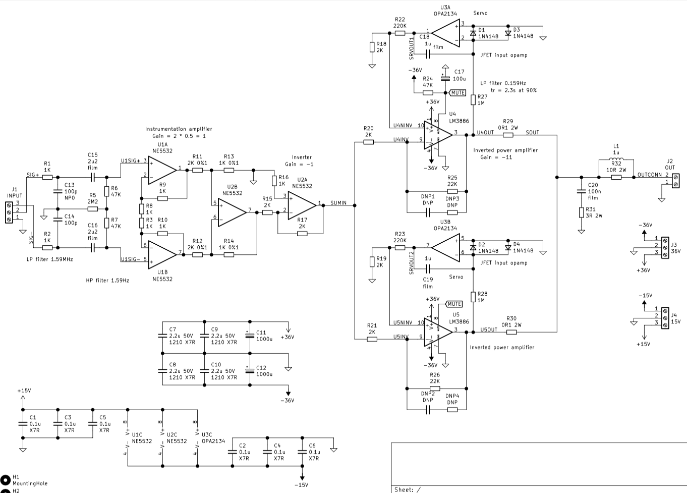

# LM3886x2_inv_bal_servo

## Schematics:

Two paralleled LM3886 are used to double the current drive and to increase the power output. Safe voltage to power the amplifier is 36V.
Gain is set to 11 V/V. Benefits of using two chips in parallel include: increase of the output drive capability of an amplifier, reduced voltage noise (better SNR), and reduced output offset error.

## PCB rendered in 3d:

## PCB layout:

Bottom layer is GND. Top layer is signal + power and GND poured in between. Stiching vias are then applied to connect bottom and top GND planes to ensure those are as close to 0 as possible.
